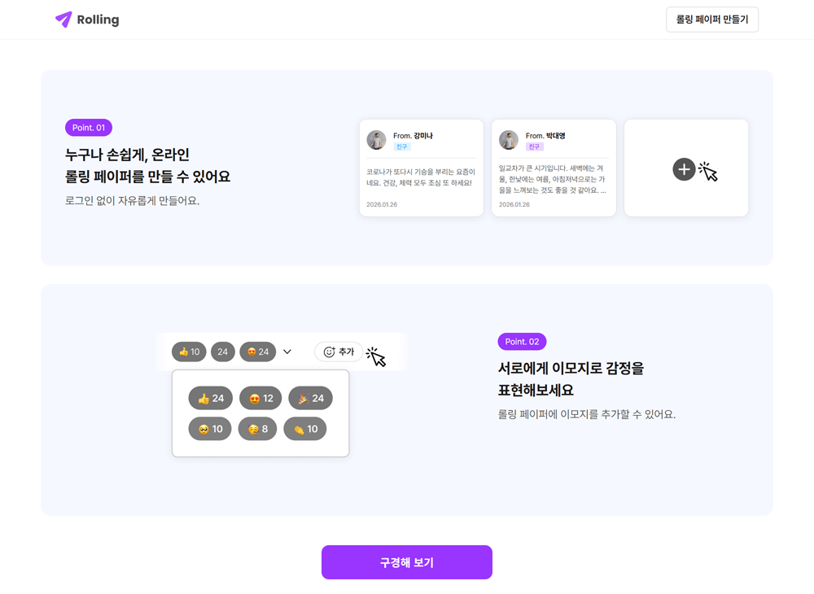
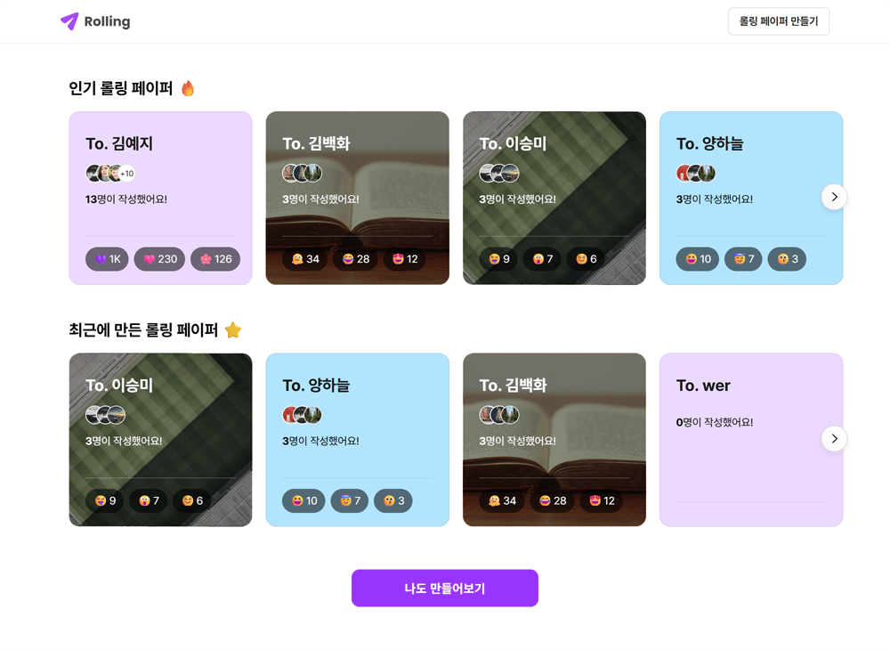
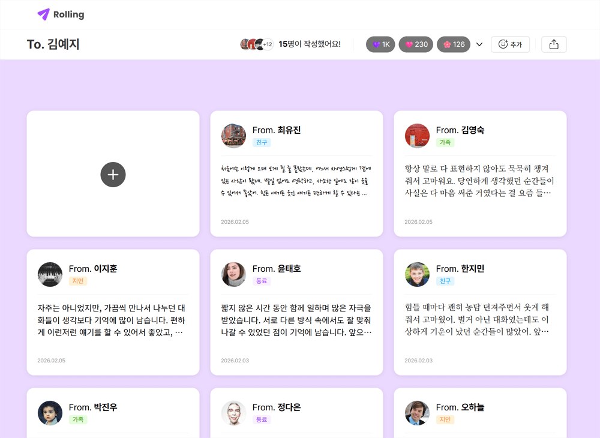
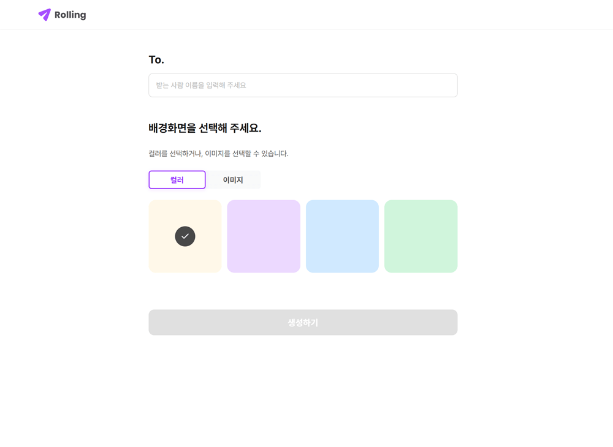
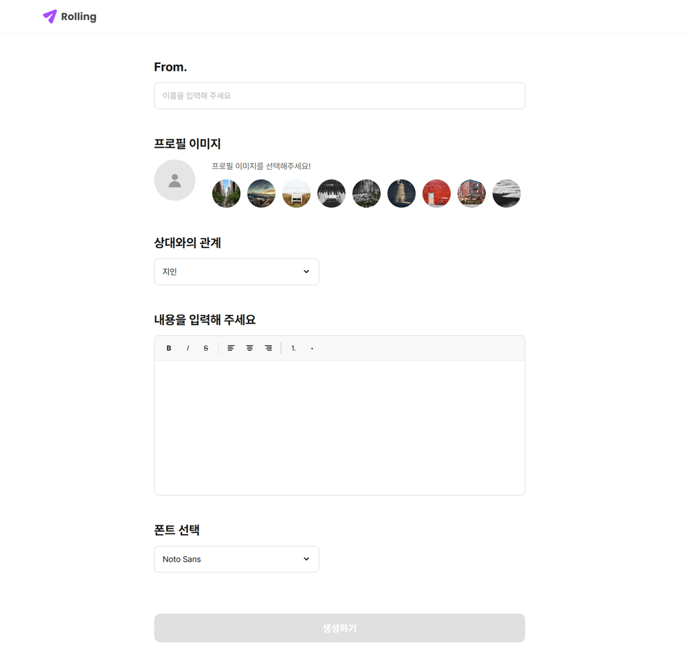

# Rolling

> 온라인 롤링페이퍼를 생성하고 메시지를 주고받을 수 있는 웹 서비스

[배포 URL](https://22-part2-team1-basic.vercel.app/)

## 🖥️ 데모 화면

| 메인 페이지                        | 롤링페이퍼 목록                    | 상세 페이지                            |
| ---------------------------------- | ---------------------------------- | -------------------------------------- |
|  |  |  |

| 롤링페이퍼 작성                    | 메시지 작성                              |
| ---------------------------------- | ---------------------------------------- |
|  |  |

---

## 🗒️ 목차

- [🗂️ 프로젝트 소개](#%EF%B8%8F-프로젝트-소개)
- [💻 기술 스택](#-기술-스택)
- [🌟 주요 기능](#-주요-기능)
- [👥 팀원 소개](#-팀원-소개)
- [📂 프로젝트 구조](#-프로젝트-구조)
- [🚀 설치 및 실행](#-설치-및-실행)
- [📅 개발 일정](#-개발-일정)
- [🤝 협업 컨벤션](#-협업-컨벤션)
- [🔧 이슈 및 해결 방법](#-이슈-및-해결-방법)
- [🌐 배포](#-배포)

---

## 🗂️ 프로젝트 소개

### 프로젝트 개요

- **프로젝트명**:
  Rolling
- **개발 기간**:
  2026.01.26 ~ 2026.02.09 (2주)
- **프로젝트 설명**:
  사용자가 간편하게 롤링페이퍼를 생성하고, 링크 공유를 통해 여러 사람이 메시지와 리액션을 남길 수 있는 **온라인 롤링페이퍼 서비스**입니다.
  반응형 디자인과 애니메이션 UX를 적용하여, 다양한 디바이스 환경에서도 자연스럽고 직관적인 사용자 경험을 제공하는 것을 목표로 제작되었습니다.
  React 기반 SPA로 구현되었으며 REST API 통신을 통해 데이터를 관리합니다.

### 프로젝트 목표

- 사용자 친화적인 UI/UX 구현
- 반응형 웹 디자인 적용
- 효율적인 상태 관리 및 API 통신
- 재사용 가능한 컴포넌트 설계

---

## 💻 기술 스택

### Frontend

- **Core**: React 19.2.0
- **Build Tool**: Vite 7.2.4
- **Routing**: React Router DOM 7.13.0
- **Styling**: CSS Modules
- **Editor**: TipTap 3.18.0
- **UI Libraries**:
  - emoji-picker-react 4.17.3
  - @floating-ui/dom 1.7.5

### Code Quality

- **Linting**: ESLint 9.39.1
- **Formatting**: Prettier 3.8.1
- **CSS Linting**: Stylelint 17.0.0

### Development

- **Version Control**: Git & GitHub
- **Package Manager**: npm

---

## 🌟 주요 기능

### 1. 공통

- 반응형 디자인
  - Desktop : `1024px` 이상
  - Tablet : `768px` ~ `1023px`
  - Mobile : `360px` ~ `767px`
- 에러 발생 시 : 에러 유형에 따라 **리다이렉트** 혹은 **Toast 알림**으로 대응
- 로딩 발생 시 : **로딩 모달 또는 로딩 스피너** 표시

### 2. 메인 페이지

롤링페이퍼 서비스의 메인 페이지

- 소개 영역에 **Fade In 애니메이션을 적용하여 자연스럽고 부드러운 첫 화면 진입 UX 제공**
- 시맨틱 태그 및 대체 텍스트 적용 등 **접근성(Accessibility)** 대응

### 3. 롤링페이퍼 목록 페이지

서버에 등록된 롤링페이퍼 목록을 인기순 / 최신순으로 조회할 수 있는 페이지

- 목록 진입 시 **Fade In 애니메이션을 적용하여 콘텐츠 노출을 자연스럽게 유도**
- 롤링페이퍼 **인기순 / 최신순 정렬 기능**
- **페이지네이션 슬라이드 UI** 제공

### 4. 롤링페이퍼 만들기 페이지

새로운 롤링페이퍼를 생성할 수 있는 페이지

- `To.` Input에 값을 입력하지 않고 **Focus Out 시 에러 메시지 출력**
- 배경을 `컬러` 또는 `이미지` 중 선택 가능
  - `컬러` 선택 시 : 4가지 배경색 중 선택
  - `이미지` 선택 시 : 4가지 배경 이미지 중 선택
  - 옵션 전환 및 선택 시 **자연스러운 전환 애니메이션을 통해 사용자 경험(UX) 향상**
- 모든 필수 값 입력 시에만 **생성하기 버튼 활성화**
- 생성하기 버튼 클릭 시, 서버로 **새로운 롤링페이퍼 데이터 전송**

### 5. 생성된 롤링페이퍼 페이지

수신한 메시지 및 리액션 정보를 확인할 수 있는 페이지

**메시지**

- 최신순으로 **무한 스크롤 방식 배치**
- 메시지 클릭 시 **모달을 통한 상세 내용 확인**
- 모달 **Fade In / Fade Out 애니메이션 적용**

**리액션**

- 반응 수가 많은 이모지를 **최대 8개까지 출력**
- **이모지 버튼** 또는 **이모지 플러그인으로 리액션 추가 가능**
- 리액션 추가 시 **실시간 데이터 반영**
- 1,000 이상 반응 수는 **숫자 포맷팅(1K 등) 처리**

**공유**

- 카카오톡 공유 기능
- URL 복사 기능

### 6. 생성된 롤링페이퍼 수정 페이지

생성된 롤링페이퍼 및 수신 메시지를 삭제할 수 있는 페이지

**롤링페이퍼 삭제**

- `삭제하기` 버튼 클릭 시 **확인 모달 표시**
- 확인 시 롤링페이퍼 삭제 후 **목록 페이지로 리다이렉트**

**수신한 메시지 삭제**

- `휴지통` 버튼 클릭 시 **확인 모달 표시**
- 확인 시 메시지 삭제 후 **목록에 즉시 반영**

### 7. 롤링페이퍼에 메시지 보내기 페이지

다른 사용자의 롤링페이퍼에 메시지를 작성하여 전송할 수 있는 페이지

- `From.` Input에 값을 입력하지 않고 **Focus Out 시 에러 메시지 출력**
- 프로필 이미지 선택 기능
  - 선택한 이미지 **실시간 미리보기 제공**
  - 선택하지 않을 경우 **기본 이미지 자동 적용**
- **TipTap 에디터**를 이용한 리치 텍스트 작성
- 폰트 선택 시 **에디터에 실시간 반영**
- 모든 필수 값 입력 시에만 **생성하기 버튼 활성화**
- 생성하기 버튼 클릭 시, 서버로 **메시지 데이터 전송**

---

## 👥 팀원 소개

| 이름   | 역할          | 담당 기능                                                                                  | GitHub                                       |
| ------ | ------------- | ------------------------------------------------------------------------------------------ | -------------------------------------------- |
| 김예지 | 팀장/Frontend | 생성된 롤링페이퍼 페이지 `/post/{id}`<br>생성된 롤링페이퍼 수정 페이지 `/post/{id}/edit`   | [@anarose314](https://github.com/anarose314) |
| 김백화 | Frontend      | 메인 페이지 `/`                                                                            | [@baekhwa](https://github.com/baekhwa)       |
| 양하늘 | Frontend      | 롤링페이퍼 만들기 페이지 `/post`<br>롤링페이퍼에 메시지 보내기 페이지 `/post/{id}/message` | [@YHNeul](https://github.com/YHNeul)         |
| 이승미 | Frontend      | 롤링페이퍼 목록 페이지 `/list`                                                             | [@dltmdall](https://github.com/dltmdall)     |

### 역할 분담 상세

**[ 공통 ]**

- PR 코드 리뷰 및 병합

**[ 김예지 ]**

**1. 페이지**

- 생성된 롤링페이퍼 페이지 `/post/{id}`
- 생성된 롤링페이퍼 수정 페이지 `/post/{id}/edit`
  - 퍼블리싱
  - 기능 구현

**2. Project Setup**

- Vite + React
- ESLint / Prettier / Stylelint 옵션 세팅
- 기본 폴더 구조 및 Router 세팅
- 폰트 컬러 및 z-index 변수 설정
- Alias 설정
- GitHub 세팅

**3. 공통 컴포넌트**

- UI 파츠 (유저 리스트, 이모지 버튼)
- 로딩 화면
- Toast 퍼블리싱

**4. 기타**

- 스케줄 관리 및 상황 체크
- 문서화 작업

**[ 김백화 ]**

**1. 페이지**

- 메인 페이지 `/`
  - 퍼블리싱
  - 기능 구현
- 롤링페이퍼 목록 페이지 `/list`
  - 퍼블리싱
- 생성된 롤링페이퍼 페이지 `/post/{id}` `/post/{id}/edit`
  - 카카오톡 / URL 공유 기능 구현
- NotFound 페이지 (404 Error 페이지)
  - 퍼블리싱

**2. 기타**

- favicon 적용

**[ 양하늘 ]**

**1. 페이지**

- 롤링페이퍼 만들기 페이지 `/post`
- 롤링페이퍼에 메시지 보내기 페이지 `/post/{id}/message`
  - 퍼블리싱
  - 기능 구현

**2. 공통 컴포넌트**

- 에러 페이지
- 헤더
- 버튼
- Toast Hook

**3. 기타**

- API 연동 및 에러 처리 Hook 작성
- Vercel을 이용한 빌드 및 배포
- 발표 자료 작성

**[ 이승미 ]**

**1. 페이지**

- 롤링페이퍼 목록 페이지 `/list`
  - 퍼블리싱 수정
  - 기능 구현

---

## 📂 프로젝트 구조

```
22-part2-team1-basic
├─ .github/                # GitHub 설정 (이슈 템플릿 등)
├─ src/                    # 소스 코드 (메인)
│  ├─ api/                 # API 통신 로직
│  ├─ assets/              # 정적 리소스
│  ├─ components/          # React 컴포넌트
│  │  ├─ common/           # 공통 컴포넌트
│  │  │  ├─ Button/
│  │  │  ├─ EmojiButton/
│  │  │  ├─ Loading/
│  │  │  ├─ TextField/
│  │  │  ├─ Toast/
│  │  │  └─ ...
│  │  ├─ feature/          # 기능별 컴포넌트
│  │  │  └─ PostDetail/
│  │  │     ├─ Card.jsx
│  │  │     ├─ CardList.jsx
│  │  │     ├─ EmojiReactions.jsx
│  │  │     ├─ LinkShare.jsx
│  │  │     └─ ...
│  │  └─ layout/           # 레이아웃 컴포넌트
│  │     ├─ Header.jsx
│  │     ├─ Header.module.css
│  │     └─ Layout.jsx
│  │
│  ├─ constants/           # 상수 정의
│  ├─ hooks/               # Custom Hooks
│  ├─ pages/               # 페이지 컴포넌트
│  │  ├─ Home/
│  │  ├─ PostList/
│  │  ├─ PostCreate/
│  │  ├─ PostDetail/
│  │  ├─ MessageCreate/
│  │  ├─ Error/
│  │  └─ NotFound/
│  │
│  ├─ routes/              # 라우팅 설정
│  ├─ styles/              # 전역 스타일
│  ├─ utils/               # 유틸리티 함수
│  ├─ App.jsx              # 루트 컴포넌트
│  └─ main.jsx             # 애플리케이션 진입점
│
├─ index.html              # HTML 엔트리 포인트
├─ package.json            # 프로젝트 의존성
├─ vite.config.js          # Vite 설정
├─ eslint.config.js        # ESLint 설정
└─ .prettierrc             # Prettier 설정
```

---

## 🚀 설치 및 실행

```bash
# 1. 레포지토리 클론
git clone https://github.com/22part21team/22-part2-team1-basic.git

# 2. 폴더 이동
cd 22-part2-team1-basic

# 3. 패키지 설치
npm install

# 4. 개발 서버 실행
npm run dev
```

---

## 📅 개발 일정

### 1. 프로젝트 세팅

- **1/23 (금) ~ 1/24 (토)** : 개발 환경 구축 및 스캐폴딩

### 2. UI 마크업 및 스타일링

- **1/26 (월) ~ 1/28 (수)** : 퍼블리싱 개발 완료

### 3. 기능 개발

- **1/29 (목) ~ 2/4 (수)** : 기능 개발 1차 완료 및 빌드·배포
- **2/5 (목)** : 기능 개발 2차 완료

### 4. 마무리 및 점검 단계

- **2/6 (금) ~ 2/8 (일)** : QA 및 피드백 반영, 최종 점검 후 배포
  - 발표 자료 및 `README.md` 작성 마무리
  - 코드 정리 및 불필요한 주석 제거
  - 코드 리팩토링 진행

### 5. 발표 및 제출

- **2/9 (월) 오후 1시** : 발표
- **2/9 (월) 발표 이후** : 추가 수정 사항 반영
- **2/10 (화)** : 최종 제출

---

## 🤝 협업 컨벤션

### ⏰ 코어 타임

- **플랫폼** : ZEP
- **운영 시간** : 하루 총 약 2시간
  - 13:00 ~ 14:00
  - 20:00 ~ 21:00
- 팀원 전원이 동시에 접속 가능한 시간으로 설정
- 코어 타임 외 시간에는 자율 작업 (ZEP 상주 필수 X)

### 🔊 PR 리뷰 및 병합 규칙

- 매일 저녁 8시까지 **에러가 없는 상태로 PR 등록**
- 마지막 코어 타임에 모든 인원이 코드 리뷰 진행
- 이슈가 발생한 경우 함께 해결
- 문제 없을 시 코드 리뷰어가 직접 Merge 진행
- 모든 PR의 병합 완료 후, `dev` 브랜치의 최신 상태를 각자 로컬에 pull

### 📝 데일리 스크럼 & To-Do

- 하루 작업 시작 전 To-Do 작성 권장
- 팀 미팅 시 **이슈 및 막힌 부분 위주로 공유**

### 📋 작업 일정 및 이슈 관리

**GitHub Issues**

- 작업 리스트 관리
- 버그 및 이슈 기록

**GitHub Projects**

- 전체 일정
- 진행 현황 시각화

---

## 🔧 이슈 및 해결 방법

### 기술적 이슈 대응 방식

- 문제가 발생했을 경우 원인을 명확히 정리 후 해결 방법을 탐색
- 팀원 간 해결이 어려운 경우 강사님 / 멘토님께 논의 후 방향 결정

### 협업 중 갈등 해결 원칙

**1. 이슈 명확화**

- 무엇이 문제인지, 왜 문제가 되는지 정리

**2. 의견 공유**

- 각자의 입장을 짧고 명확하게 공유

**3. 대안 제시**

- 최소 1개 이상의 해결 방안 제시

**4. 결정 및 기록**

- 결정된 내용은 문서 또는 협업 채널에 기록

### 의사결정 방식

- 일반적인 UI / 기능 결정 : 다수결
- 설계 및 프로젝트 방향 결정 : 합의제 + 필요 시 팀장 최종 판단
- 긴급 상황 / 충돌 발생 시 : 팀장 판단 우선

※ 팀 내부에서 해결이 어려운 문제는 강사님 또는 멘토님께 자문을 구하는 방식으로 진행

---

## 🌐 배포

- **배포 플랫폼** : Vercel
- **배포 방식**
  - 개발 기간 : GitHub `dev` 브랜치 연동 자동 배포
  - 개발 완료 후 : GitHub `main` 브랜치 연동 자동 배포
- **SPA 라우팅 대응** : `vercel.json`의 `rewrites` 설정으로 하위 경로 404 오류 방지
- **배포 URL** : [https://22-part2-team1-basic.vercel.app/](https://22-part2-team1-basic.vercel.app/)
